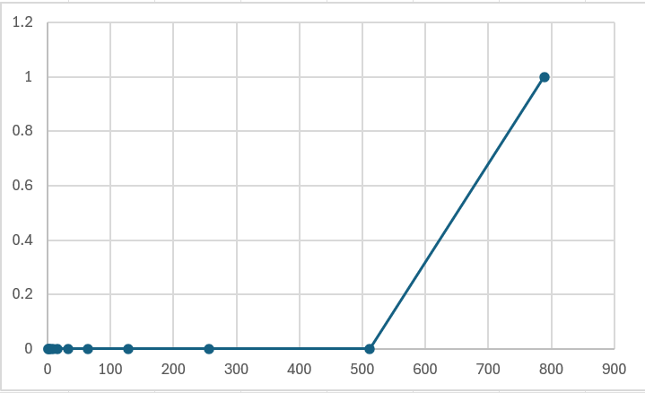

# The idea behind the custom hash function

1. because we need to generate a 256 bit hash, we can start with 4 random 64 bit seed numbers(ulong in c#) because 64 bits x 4 = 256 bits
2. we take the input text and for each input byte, we perform add/xor/rotate operations, and cross-mix with the other seed numbers.
3. at the end when the original 4 seed number are all mixed with the input bytes we format each 64-bit seed number as 16 hex chars and concatenate to 64-char uppercase hex string.

# Instructions to run the application

## Using CLI
1. make sure you are in the Hash project folder.
2. use the following command `dotnet run <algorithm> <file_path>`

## Using console
1. make sure you are in the Hash project folder.
2. use the following command `dotnet run`

# Instructions to generate test data

You can generate test data using the CLI arguments:

1. make sure you are in the Hash project folder.
2. use the following command `dotnet run generateTestData <folder_path>`, here `<folder_path>` is the folder path where the test data will be created.

# Instructions to run tests on generated data
1. make sure you are in the Hash project folder.
2. use the following command `dotnet run generateTestsResults <folder_path> <algorithm> <generated_test_data_folder_path> <results_output_folder_path_>`

# Tests

## Custom hash function

### Output size test results

| File name | Hash | Hash length |
| --- | --- | --- |
| empty-file-1.txt | DC6D0C402D9C247F802FB614C5C8C1EB86DE0F8C2EB03CB2692A7F08CAEFAF33 | 64 |
| empty-file-2.txt | DC6D0C402D9C247F802FB614C5C8C1EB86DE0F8C2EB03CB2692A7F08CAEFAF33 | 64 |
| empty-file-3.txt | DC6D0C402D9C247F802FB614C5C8C1EB86DE0F8C2EB03CB2692A7F08CAEFAF33 | 64 |
| empty-file-4.txt | DC6D0C402D9C247F802FB614C5C8C1EB86DE0F8C2EB03CB2692A7F08CAEFAF33 | 64 |
| empty-file-5.txt | DC6D0C402D9C247F802FB614C5C8C1EB86DE0F8C2EB03CB2692A7F08CAEFAF33 | 64 |
| file-with-one-char-1.txt | F867489B14C7E3C09721F47E1441EDF0ADF975BD47538A156220303BB085EA69 | 64 |
| file-with-one-char-2.txt | 747993521E00CF8A9129F6D8270A9E0CB5ADA6C09D0EA5ECBB22E943CD562D2C | 64 |
| file-with-one-char-3.txt | 61F00B6FD8EB9339EE24FD2C207DF06FEC3A1768286485CCBCF029AC35734C8A | 64 |
| file-with-one-char-4.txt | C8D50105F967D5A18D4ED74D56161812D726C8A76BBD2507A579672368562D88 | 64 |
| file-with-one-char-5.txt | AB3073A6AEAEDFF6F8CC79D617D739656DFEE85408D604555B3B83D2FE6448D4 | 64 |
| file-with-random-chars-1.txt | ECD6F8709C840169FF76FB2DC8B650D6D73D1DE4CE2DC306FAF8406ABBE4DA6C | 64 |
| file-with-random-chars-2.txt | 1A6EE0F4A9714468AFEC90EAF3D13DC57C3FEDD6E74D510F188B436EFE955AC1 | 64 |
| file-with-random-chars-3.txt | FF4B9B51AC87E6DED97066AA31D79B93DC4F2F0E121F36ECD36658DED613DF80 | 64 |
| file-with-random-chars-4.txt | 0349450D7F6592F7E9F97BC5F1437389C4ECAE37A9D59E47FCD70C252388ABE1 | 64 |
| file-with-random-chars-5.txt | A2024075AF4F3B637F183C0A4E94B101C690324375BD74B4B91F7B8D61A83953 | 64 |

### Effectiveness test results

| Line count | Hash | Time (ms) |
| --- | --- | --- |
| 1 | B4A41C587DA57BF0743958E30E6531F8DA93727BE6EE3719FC16DE688435D357 | 0 |
| 2 | 9774A1DA5C4467B49322D6078EDFE2C6BA92EF10FC772FE399F3FC2FE72352E4 | 0 |
| 4 | 65B8A4A1D54C4C23973C2DCB3862704218BDB82D00961E5C1252257A419FF5B1 | 0 |
| 8 | 013BDAB6E3B704943B1944373FE1F2EB76756A9E916BE466E93D116053BD4F1E | 0 |
| 16 | B097E51597BEF53CE95769BF4F02D66886FB2C943B90B6A20C63A68CAA6E567F | 0 |
| 32 | 7C7F10A9E43A042A2101FFBEECAA82C2E34B29A9550B3CDFD8F3E5E53B662473 | 0 |
| 64 | 9F8E2E8EFA028E81C4EB080D3783E07E429D5F84B621B70EA69CDBBB4078BB08 | 0 |
| 128 | CABBBC6735895286691009F681F67556A5F9C8C300EAACDEB57CC38F081CF660 | 0 |
| 256 | B1CF3FE34602CBC3886A2EE780BE38CA8CF9CD54461C06373EDA4413BFF41861 | 0 |
| 512 | 2D906BC105893817648D92F42148C64B9E7EBC82249927287BDF414413761F42 | 0 |
| 789 | B7CECD44ACE77FF91E38CB7E0B83B99BAC3CC90FBE2C11C69E3F523B4C762FCD | 1 |

### Determinism test results

| File name | Hash | Times ran | Is deterministic? |
| --- | --- | --- | --- |
| empty-file-1.txt | DC6D0C402D9C247F802FB614C5C8C1EB86DE0F8C2EB03CB2692A7F08CAEFAF33 | 5 | True |
| empty-file-2.txt | DC6D0C402D9C247F802FB614C5C8C1EB86DE0F8C2EB03CB2692A7F08CAEFAF33 | 5 | True |
| empty-file-3.txt | DC6D0C402D9C247F802FB614C5C8C1EB86DE0F8C2EB03CB2692A7F08CAEFAF33 | 5 | True |
| empty-file-4.txt | DC6D0C402D9C247F802FB614C5C8C1EB86DE0F8C2EB03CB2692A7F08CAEFAF33 | 5 | True |
| empty-file-5.txt | DC6D0C402D9C247F802FB614C5C8C1EB86DE0F8C2EB03CB2692A7F08CAEFAF33 | 5 | True |
| file-with-one-char-1.txt | F867489B14C7E3C09721F47E1441EDF0ADF975BD47538A156220303BB085EA69 | 5 | True |
| file-with-one-char-2.txt | 747993521E00CF8A9129F6D8270A9E0CB5ADA6C09D0EA5ECBB22E943CD562D2C | 5 | True |
| file-with-one-char-3.txt | 61F00B6FD8EB9339EE24FD2C207DF06FEC3A1768286485CCBCF029AC35734C8A | 5 | True |
| file-with-one-char-4.txt | C8D50105F967D5A18D4ED74D56161812D726C8A76BBD2507A579672368562D88 | 5 | True |
| file-with-one-char-5.txt | AB3073A6AEAEDFF6F8CC79D617D739656DFEE85408D604555B3B83D2FE6448D4 | 5 | True |
| file-with-random-chars-1.txt | 46493F99AAD4FDCCD433C26BA2565645BD8EED32FD2E2C8435A41E85F7254C88 | 5 | True |
| file-with-random-chars-2.txt | 692A46943FE4A02F37B3D96EA333F543850474F64EB7735F865AC7AEDF8E3124 | 5 | True |
| file-with-random-chars-3.txt | 70E9FAE787E0255707DB7EA08FD322F1FFB9894E2738DE7651C119298471D4A3 | 5 | True |
| file-with-random-chars-4.txt | 01CC552E51FB8481E9C0916CDD6B2A4EA9E989B56B5C781789D3A54A86A12392 | 5 | True |
| file-with-random-chars-5.txt | 71E86D9329E0DBBA8C2789FE03047323883A55C3DD621B0DABE8C61B4A1B4FBB | 5 | True |

### Collision search test results

| File name | Collision count |
| --- | --- |
| file-with-string-pairs-length-10.txt | 0 |
| file-with-string-pairs-length-100.txt | 0 |
| file-with-string-pairs-length-1000.txt | 0 |
| file-with-string-pairs-length-500.txt | 0 |

### Avalance effect test results

| Level | Minimum difference% | Maximum difference% | Average difference% |
| --- | --- | --- | --- |
| Hex | 78.12 | 100.00 | 93.75 |
| Bits | 12.79 | 25.00 | 19.44 |

## AI hash function

### Output size test results

| File name | Hash | Hash length |
| --- | --- | --- |
| empty-file-1.txt | EFD01F60BA9929266BCB9D63EB8EAB8B83D8725B90D9D7E1765BA009AE97681A | 64 |
| empty-file-2.txt | EFD01F60BA9929266BCB9D63EB8EAB8B83D8725B90D9D7E1765BA009AE97681A | 64 |
| empty-file-3.txt | EFD01F60BA9929266BCB9D63EB8EAB8B83D8725B90D9D7E1765BA009AE97681A | 64 |
| empty-file-4.txt | EFD01F60BA9929266BCB9D63EB8EAB8B83D8725B90D9D7E1765BA009AE97681A | 64 |
| empty-file-5.txt | EFD01F60BA9929266BCB9D63EB8EAB8B83D8725B90D9D7E1765BA009AE97681A | 64 |
| file-with-one-char-1.txt | FFB500860206041165F5891142C333D93B4BFB0F9D05CE729FACE22466FDF028 | 64 |
| file-with-one-char-2.txt | 466786A8C2172D5CC743C169500882909E84CD23B4A5A41F2A13DB6ADAFD0234 | 64 |
| file-with-one-char-3.txt | 076721BAD6E4B89299E50431AB8A5F1D7C96ACC637B06A31D91406BF8FD45EF8 | 64 |
| file-with-one-char-4.txt | 764FF8F204CF02F062E38EE85B6B3C4654A3F0AA0C65D81EEE344190A85AE2D1 | 64 |
| file-with-one-char-5.txt | 39F87E77DFB796945E5E250B2338F7B1D67002287985B9893CBE610D66C5EFB5 | 64 |
| file-with-random-chars-1.txt | 833BF332ADB3BBF6D5CBB7ACE1167C2587108749C8208A191BD60D2BF0B31CF5 | 64 |
| file-with-random-chars-2.txt | 589EB52E9AA16E66BA9EDC8CAD22557D612C5A118C633A782A7823793830302D | 64 |
| file-with-random-chars-3.txt | 242A5B5896E8BAB306B10B68E1ACF8A392D931711E159239D505BF882D9C2BC6 | 64 |
| file-with-random-chars-4.txt | 1CB8F9EC1469492496AE86E42FAF15AD35D4EEB54F8A57A2E6030876440BD2C1 | 64 |
| file-with-random-chars-5.txt | 42F7FCBF43DB01F6433A5EAB26135553D8F204EED6D2026D4CE32C429242390A | 64 |

### Effectiveness test results

| Line count | Hash | Time (ms) |
| --- | --- | --- |
| 1 | 0BD43D2D65C6A19BA9EBE08F3FA9D3693FDE088260C98B6B7A16670AD2CC1661 | 0 |
| 2 | D50CC43E3CAB179A209696C640C048B34BB36BAF5479A8101095792C334CF030 | 0 |
| 4 | 512EF90CC329BA6E9BE12FCA30570223DC3D9940738FB01433F379F591AE7793 | 0 |
| 8 | 8E620B2CD9FB74BF65258A8002A05122923AB68914D0770A219197A31748E5D1 | 0 |
| 16 | 8FE5E97C647F7012C6EB7D3007754B917C8291329B86869BDC47B858037052AE | 0 |
| 32 | 66D862E33F0DED6D7DBD5E8B3D6987F7296A665BCFB6C1E6280E44AF439CA0E0 | 0 |
| 64 | 63C13A619086F81FBA6A2ED6F72A21D062FC885101A0B8AACEA209BE047B699B | 0 |
| 128 | 37236B95E0DB5D09720AEA75F811959F079CFDF7EA9D07239944ADC8F6B14047 | 0 |
| 256 | 079EAD34BCBEF2C60CD49A6A20AFD8DDF00BC90DB2474CB4143D524B061F8A42 | 0 |
| 512 | C54090836063E0C576916F23E772FA29E77E3EB8987184A5B37D80F67BC9D65C | 1 |
| 789 | D15ECF243778FD70FB65B449F093E194BA8C3426F7F32FF2657F27BA08909656 | 1 |

### Determinism test results

| File name | Hash | Times ran | Is deterministic? |
| --- | --- | --- | --- |
| empty-file-1.txt | EFD01F60BA9929266BCB9D63EB8EAB8B83D8725B90D9D7E1765BA009AE97681A | 5 | True |
| empty-file-2.txt | EFD01F60BA9929266BCB9D63EB8EAB8B83D8725B90D9D7E1765BA009AE97681A | 5 | True |
| empty-file-3.txt | EFD01F60BA9929266BCB9D63EB8EAB8B83D8725B90D9D7E1765BA009AE97681A | 5 | True |
| empty-file-4.txt | EFD01F60BA9929266BCB9D63EB8EAB8B83D8725B90D9D7E1765BA009AE97681A | 5 | True |
| empty-file-5.txt | EFD01F60BA9929266BCB9D63EB8EAB8B83D8725B90D9D7E1765BA009AE97681A | 5 | True |
| file-with-one-char-1.txt | FFB500860206041165F5891142C333D93B4BFB0F9D05CE729FACE22466FDF028 | 5 | True |
| file-with-one-char-2.txt | 466786A8C2172D5CC743C169500882909E84CD23B4A5A41F2A13DB6ADAFD0234 | 5 | True |
| file-with-one-char-3.txt | 076721BAD6E4B89299E50431AB8A5F1D7C96ACC637B06A31D91406BF8FD45EF8 | 5 | True |
| file-with-one-char-4.txt | 764FF8F204CF02F062E38EE85B6B3C4654A3F0AA0C65D81EEE344190A85AE2D1 | 5 | True |
| file-with-one-char-5.txt | 39F87E77DFB796945E5E250B2338F7B1D67002287985B9893CBE610D66C5EFB5 | 5 | True |
| file-with-random-chars-1.txt | D89DBE6F641BC21485ACD89F8E62D35E566C338D3D0F52B29347F8DD5702E5A6 | 5 | True |
| file-with-random-chars-2.txt | A3E082F1916411ED05D83445A1CB34EF0AC05F27D06E9A3F9F5223B47705DF3B | 5 | True |
| file-with-random-chars-3.txt | 1F21490174F7D3F84DF3730D3FB064472409E94BD416D0AFCDCB83D5481CD9E9 | 5 | True |
| file-with-random-chars-4.txt | AD912C319FE23625112CF529E2BE9524568A7E3DE27968A6A9A97F95CC66F72C | 5 | True |
| file-with-random-chars-5.txt | 17FFF015070B5138B1B3196CFC2036EE85833F12828F465E5F09E835ED65342C | 5 | True |

### Collision search test results

| File name | Collision count |
| --- | --- |
| file-with-string-pairs-length-10.txt | 0 |
| file-with-string-pairs-length-100.txt | 0 |
| file-with-string-pairs-length-1000.txt | 0 |
| file-with-string-pairs-length-500.txt | 0 |

### Avalance effect test results

| Level | Minimum difference% | Maximum difference% | Average difference% |
| --- | --- | --- | --- |
| Hex | 78.12 | 100.00 | 93.76 |
| Bits | 13.38 | 25.49 | 19.43 |

## SHA-256 hash function

### Output size test results

| File name | Hash | Hash length |
| --- | --- | --- |
| empty-file-1.txt | E3B0C44298FC1C149AFBF4C8996FB92427AE41E4649B934CA495991B7852B855 | 64 |
| empty-file-2.txt | E3B0C44298FC1C149AFBF4C8996FB92427AE41E4649B934CA495991B7852B855 | 64 |
| empty-file-3.txt | E3B0C44298FC1C149AFBF4C8996FB92427AE41E4649B934CA495991B7852B855 | 64 |
| empty-file-4.txt | E3B0C44298FC1C149AFBF4C8996FB92427AE41E4649B934CA495991B7852B855 | 64 |
| empty-file-5.txt | E3B0C44298FC1C149AFBF4C8996FB92427AE41E4649B934CA495991B7852B855 | 64 |
| file-with-one-char-1.txt | CA978112CA1BBDCAFAC231B39A23DC4DA786EFF8147C4E72B9807785AFEE48BB | 64 |
| file-with-one-char-2.txt | 3E23E8160039594A33894F6564E1B1348BBD7A0088D42C4ACB73EEAED59C009D | 64 |
| file-with-one-char-3.txt | 2E7D2C03A9507AE265ECF5B5356885A53393A2029D241394997265A1A25AEFC6 | 64 |
| file-with-one-char-4.txt | 18AC3E7343F016890C510E93F935261169D9E3F565436429830FAF0934F4F8E4 | 64 |
| file-with-one-char-5.txt | 3F79BB7B435B05321651DAEFD374CDC681DC06FAA65E374E38337B88CA046DEA | 64 |
| file-with-random-chars-1.txt | 434CF6CE2603077D0E59AD300680C06F6DDE2CD789D4D19E746F8A37BCBA1D83 | 64 |
| file-with-random-chars-2.txt | 701C8C93E462A11C7CEEB0E87FF994ACC37D4BEBCAE7B1DE8327FD663D390654 | 64 |
| file-with-random-chars-3.txt | 3351F49DE36153CEE6DF593B5CCD981609CA5D550BF939FDB163F3E973F3D7E8 | 64 |
| file-with-random-chars-4.txt | CCD282E05D23358686998FF1B66359AE16D906C25171459CC86C1861DBC6E9D0 | 64 |
| file-with-random-chars-5.txt | 01FDD9EE3B0168CF00781977DC406367D7D73BD99E2306F1A2C3A975BD7AE9DC | 64 |

### Effectiveness test results

| Line count | Hash | Time (ms) |
| --- | --- | --- |
| 1 | 23BB1827B8E3C2FD6AEE3008BFFFA8426A9E406237736FD4821AAAFC9C32A1D8 | 0 |
| 2 | 65CE11C61A109B271CB2624DA16B08E1E7BE9AABDB0ACE007FE45EAB81159E4F | 0 |
| 4 | A739E2667B0B4D4AF8701F59F929E31AEBE723A819CDC4C2B1C0E1078C598DAA | 0 |
| 8 | 7C3A2FB4E1C6D0E932A309CC920424CB7DC47C99EB00B3065039AC1FA03BEC91 | 0 |
| 16 | 1D87EFD296C08250AB5D44E66C7476FDF135726784235C4E2250D29D05AF2867 | 0 |
| 32 | 88292594682AF8F57676B9BDFEEF9852F5F969F6F9BD23A21261258B20F1E04B | 0 |
| 64 | 7B18FB1F38E44F215D954B26DB4E142B23747D455A46A34C12E611F846164E5D | 0 |
| 128 | 7DF9AC1CE6A458C721BEAAE945EF77480329035F0D24ADC14E9943FEB67D8DCE | 0 |
| 256 | C17C05CCE6CE5DCCE1D1B91B3EAC9BB9316C3D972CAEE08DBE273311176D5631 | 0 |
| 512 | D8265A0A8E249A16C8541FBAC0C8392D28B20CC9098DE6F4F1D7C008FD9287A4 | 0 |
| 789 | BCFADD42E937DBD305D25AFE79AF9F846BC73999F7CEBC901AB57315FBDB974E | 0 |

### Determinism test results

| File name | Hash | Times ran | Is deterministic? |
| --- | --- | --- | --- |
| empty-file-1.txt | E3B0C44298FC1C149AFBF4C8996FB92427AE41E4649B934CA495991B7852B855 | 5 | True |
| empty-file-2.txt | E3B0C44298FC1C149AFBF4C8996FB92427AE41E4649B934CA495991B7852B855 | 5 | True |
| empty-file-3.txt | E3B0C44298FC1C149AFBF4C8996FB92427AE41E4649B934CA495991B7852B855 | 5 | True |
| empty-file-4.txt | E3B0C44298FC1C149AFBF4C8996FB92427AE41E4649B934CA495991B7852B855 | 5 | True |
| empty-file-5.txt | E3B0C44298FC1C149AFBF4C8996FB92427AE41E4649B934CA495991B7852B855 | 5 | True |
| file-with-one-char-1.txt | CA978112CA1BBDCAFAC231B39A23DC4DA786EFF8147C4E72B9807785AFEE48BB | 5 | True |
| file-with-one-char-2.txt | 3E23E8160039594A33894F6564E1B1348BBD7A0088D42C4ACB73EEAED59C009D | 5 | True |
| file-with-one-char-3.txt | 2E7D2C03A9507AE265ECF5B5356885A53393A2029D241394997265A1A25AEFC6 | 5 | True |
| file-with-one-char-4.txt | 18AC3E7343F016890C510E93F935261169D9E3F565436429830FAF0934F4F8E4 | 5 | True |
| file-with-one-char-5.txt | 3F79BB7B435B05321651DAEFD374CDC681DC06FAA65E374E38337B88CA046DEA | 5 | True |
| file-with-random-chars-1.txt | 6686FEE8ADD213FC33B8BFB09D81FA50913951A0F70261D454B9A23F22859403 | 5 | True |
| file-with-random-chars-2.txt | 2B13AAF0D3F4765E571D53F6831835217947A3170B1AC0EB73CB3D6476F5C534 | 5 | True |
| file-with-random-chars-3.txt | 17DC74CB90C1232863A456D9125767B12FD184984D921AA0896003342D6CD4FE | 5 | True |
| file-with-random-chars-4.txt | 0D47AD0164C72471EFD47F21C8B88F0E4DDE8F221BD7372CD0A7515634B7B062 | 5 | True |
| file-with-random-chars-5.txt | 4B37F6E6770F8788EDD7783E2EEA3223DF93AC029DCECF9B483947F77B4862BF | 5 | True |

### Collision search test results

| File name | Collision count |
| --- | --- |
| file-with-string-pairs-length-10.txt | 0 |
| file-with-string-pairs-length-100.txt | 0 |
| file-with-string-pairs-length-1000.txt | 0 |
| file-with-string-pairs-length-500.txt | 0 |

### Avalance effect test results

| Level | Minimum difference% | Maximum difference% | Average difference% |
| --- | --- | --- | --- |
| Hex | 76.56 | 100.00 | 93.74 |
| Bits | 13.38 | 24.90 | 19.44 |

# hiding, puzzle-friendliness

original text: `Lietuva`
salt: `$988e213`
custom without salt: `FD52E290ED45D6CC9C2D3430778D9FC7036827BF4F6F8E74D00C7B8C314A2C9C`
custom with salt: `43DB63D8EDC73370E2232BE9D5E2235173302C57B99D4256DB64C7E4CAF8D2DA`
ai without salt: `8C3EB676AD4B068E9AA13E79CB306599062BD3E5A7914EE487F578C7193CFA19`
ai with salt: `9DD49714AB4785F12833DF1F52C60F269A7C3401C8426F31D707E5E6E6E6388F`
sha256 without salt: `5109820F748796128B8BAFD3806D05511BC89AD77FC3CDA960FACF37A639BC7F`
sha256 with salt: `3AA3A41BFF20CCC1473453E31B9BBBA714BC0F66E771AF5D9E8827BBF70DC08F`

# Hash Function Comparison Table

| Aspect                | Custom Hash                                   | AI Hash                                      | SHA-256                                      |
|-----------------------|-----------------------------------------------|----------------------------------------------|----------------------------------------------|
| **Output size**       | 256-bit (64 hex chars)                        | 256-bit (64 hex chars)                       | 256-bit (64 hex chars)                       |
| **Speed**             | 0–1 ms (fast)                                | 0–1 ms (fast)                                | 0 ms (fast)                                  |
| **Determinism**       | Deterministic                                | Deterministic                                | Deterministic                                |
| **Collisions**        | None detected in tests                       | None detected in tests                       | None detected in tests                       |
| **Avalanche (Hex)**   | 78–100% (avg ~93.75%)                        | 78–100% (avg ~93.76%)                        | 76–100% (avg ~93.74%)                        |
| **Avalanche (Bits)**  | 12.8–25.0% (avg ~19.44%)                     | 13.4–25.5% (avg ~19.43%)                     | 13.4–24.9% (avg ~19.44%)                     |
| **Strengths**         | Simple design, good performance              | Similar to Custom Hash, slightly better bit spread | Industry standard, cryptographically proven |
| **Weaknesses**        | Not cryptographically proven                 | Not standardized or peer-reviewed            | None in tested categories                    |
| **Best for**          | Experimentation, lightweight hashing         | Experimentation, alternative hashing methods | Security, trusted cryptographic applications |

# Comparing with other people's hash functions

In addition to testing our own custom hash function, we compared it with the `hash_be_ai` version created by Ignas and Justas ([Andrujus/Blockchain](https://github.com/Andrujus/Blockchain/tree/v0.1)) and Gustavo hash implementation ([GustavasMarcinkevicius/Blockchain](https://github.com/GustavasMarcinkevicius/Blockchain/tree/v0.2)). All three algorithms consistently produced 256-bit (64-character) outputs and showed no collisions even after testing **400,000 random string pairs**.

Looking at avalanche effect, our custom hash achieved a **hex difference averaging ~93.7%** and **bit difference averaging ~19.4%**, which is very close to SHA-256 levels. `hash_be_ai` showed a **bit difference of ~121 out of 256 (~47%)** and a **hex difference averaging ~57 out of 64 (~89%)**, meaning it flipped about half the bits on average when a single input character was changed. Gustavo hash, in turn, produced a **hex difference average of ~89%** but a much stronger **binary-level avalanche of ~45%**, which indicates its internal bit-swapping design spreads changes widely at the bit level, though less so in the hex representation.

Performance-wise, our custom implementation completed comparable tests in **0–1 ms** regardless of input size, while `hash_be_ai` scaled linearly from **~0.00027 s for 8 lines** up to **~0.0387 s for 512 lines**. Gustavo earlier version (v0.1x) was relatively slower, but the improved v0.2x version significantly optimized speed for larger inputs while retaining collision resistance and determinism.

In summary, all three custom hashes satisfy the core requirements of a hash function: fixed output size, determinism, collision resistance, and a strong avalanche effect. Our custom hash demonstrates avalanche properties closest to SHA-256, Gustavo version shows strong binary diffusion, and `hash_be_ai` provides efficient scaling performance for larger files.

# Conclusion

Our custom hash function successfully meets the core requirements of hashing: fixed 256-bit output, determinism, collision resistance, and strong avalanche effect.  
Compared with the AI hash and SHA-256, it shows performance close to SHA-256 while remaining lightweight and simple in design.  
No collisions were detected in extensive tests, and the avalanche effect averaged ~93.7% at the hex level and ~19.4% at the bit level, nearly identical to SHA-256.  
Compared with other custom implementations (`hash_be_ai` and Gustavo’s hash), our version demonstrates balanced performance, reliable diffusion, and stable execution times of ~0–1 ms.  
While not cryptographically proven like SHA-256, it is well-suited for experimentation, educational purposes, and lightweight applications.  
For security-critical use cases, however, SHA-256 remains the most reliable choice due to its proven cryptographic strength.