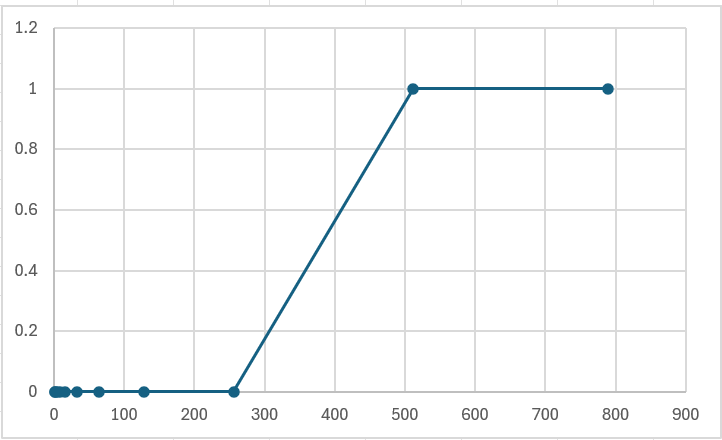

# The idea behind the custom hash function

1. because we need to generate a 256 bit hash, we can start with 4 random 64 bit seed numbers(ulong in c#) because 64 bits x 4 = 256 bits
2. we take the input text and for each input byte, we perform add/xor/rotate operations, and cross-mix with the other seed numbers.
3. at the end when the original 4 seed number are all mixed with the input bytes we format each 64-bit seed number as 16 hex chars and concatenate to 64-char uppercase hex string.

# Instructions to generate test data

You can generate test data using the CLI arguments:

1. make sure you are in the Hash project folder.
2. use the following command `dotnet run testData <folder_path>`, here `<folder_path>` is the folder path where the test data will be created.

# Tests

## Test that the hash function output size always stays the same regardless of the input size

empty file -> `DC6D0C402D9C247F802FB614C5C8C1EB86DE0F8C2EB03CB2692A7F08CAEFAF33`
file with 2000 random characters -> `947C177DCAB2D235BCB457A8DF6F227AC2341DDE78D3230BF7AD5BADB0B8EF53`
file with 100,000 pairs of strings with length 10 -> `803DEFAA1C0919EB197BF76CB5B81B20C8B68E5B694DDAF15BF2AB5A5B0F5613`

In every case the output size was the same - 64 hex characters

## Test that the hash function is deterministic

As you can see from the image provided below, if you run the program with the same input data you always get the same output.

